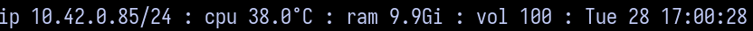

# shstatus

minimal and extensible shell statusline indended for use with `dwl`, `dwm` (or anything that needs status via `stdout`)

designed to be an example starting point for more personalised configurations

## usage
`shstatus [x]` where `x` is the time between each statusline update (length of `sleep`)

e.g for `dwl` or `dwm` simply pipe like `shstatus [x] | dwl`

**note**: for `dwl`, `dwm` : ensure that you have a **patch** that accepts `stdout` e.g [bar](https://codeberg.org/dwl/dwl-patches/src/branch/main/patches/bar)

## dependencies
* `bash` (**required**)

**optional**
* `lm-sensors` for **temperature**
* `pipewire` for **volume**

you can avoid requiring this - just adjust the module itself

## configuring
the comments should be more than enough to understand the structure. it's purposefully simple

for your own modules, programs like `brightnessctl` for backlight, `upower` for battery statistics may be a good starting point.

## license
[GNU GPLv3](LICENSE)
